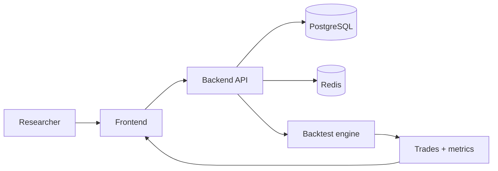

# AlphaForge

**Quantitative strategy research and backtesting infrastructure for reproducible market experiments.**

AlphaForge is a full-stack research environment for expressing trading rules, loading historical data, running transaction-cost-aware backtests, and comparing strategy results through a single workspace.

## Architecture



The included Docker Compose configuration provisions PostgreSQL, Redis, the backend service, and the frontend service.

## Research workflow

```mermaid
flowchart TD
    A[Ingest data] --> B[Define strategy logic]
    B --> C[Validate configuration]
    C --> D[Historical simulation]
    D --> E[Apply costs + slippage]
    E --> F[Inspect equity / drawdown / trades]
    F --> G[Compare experiments]
```



## Intended capabilities

- Historical data ingestion
- Strategy / alpha expression
- Position-sizing rules
- Transaction costs and slippage
- Backtest execution
- Trade logs
- Equity-curve and drawdown analysis
- Comparison across multiple experiments
- Persistent workspaces

Some capabilities may still be incomplete depending on the branch and should be treated as active development rather than guaranteed production functionality.

## Local development

### Requirements

- Docker
- Docker Compose
- Git

### Start the stack

```bash
docker-compose up --build
```

Default service ports from the repository configuration:

- Frontend: `http://localhost:3000`
- Backend API: `http://localhost:8000`
- PostgreSQL: `5432`
- Redis: `6379`

## Research principles

AlphaForge is intentionally a **research environment, not a brokerage or live-trading system**. A credible backtest should explicitly account for:

- train / validation / out-of-sample separation;
- survivorship and look-ahead bias;
- transaction costs and slippage;
- realistic fill assumptions;
- parameter-selection bias;
- reproducibility of experiment state.

## Status

Active prototype. The goal is not to produce impressive backtest curves; it is to make strategy experiments easier to express, reproduce, inspect, and invalidate.